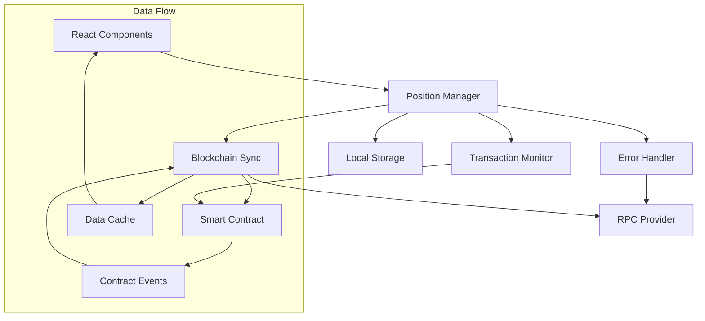

# Design Document

## Overview

Система улучшенного управления позициями представляет собой комплексное решение для надежной работы с торговыми позициями в PVA DApp. Система обеспечивает синхронизацию с блокчейном, кэширование данных, мониторинг транзакций и обработку ошибок.

## Architecture

Архитектура построена на принципах разделения ответственности и использует современные паттерны React для управления состоянием:



## Components and Interfaces

### Position Manager Hook

Центральный хук для управления позициями:

```typescript
interface UsePositionManager {
  positions: Position[];
  loading: boolean;
  error: string | null;
  refreshPositions: () => Promise<void>;
  buyTokens: (amount: number) => Promise<string>;
  sellPosition: (positionId: number) => Promise<void>;
  getPositionById: (id: number) => Position | null;
}

interface Position {
  id: number;
  owner: string;
  amountTokens: bigint;
  buyPrice: bigint;
  createdAt: number;
  unlockAt: number;
  partId: number;
  league: League;
  closed: boolean;
  onChainId?: number;
  transactionHash?: string;
  status: 'active' | 'locked' | 'ready' | 'closed';
}
```

### Blockchain Sync Service

Сервис синхронизации с блокчейном:

```typescript
interface BlockchainSyncService {
  syncUserPositions: (userAddress: string) => Promise<Position[]>;
  subscribeToPositionEvents: (userAddress: string, callback: (position: Position) => void) => void;
  unsubscribeFromEvents: () => void;
  getPositionFromContract: (positionId: number) => Promise<Position>;
  validatePositionData: (position: any) => boolean;
}
```

### Transaction Monitor

Компонент для отслеживания транзакций:

```typescript
interface TransactionMonitor {
  pendingTransactions: Map<string, PendingTransaction>;
  monitorTransaction: (hash: string, type: TransactionType) => Promise<TransactionResult>;
  cancelMonitoring: (hash: string) => void;
  getTransactionStatus: (hash: string) => TransactionStatus;
}

interface PendingTransaction {
  hash: string;
  type: 'buy' | 'sell';
  timestamp: number;
  retryCount: number;
  status: 'pending' | 'confirmed' | 'failed';
}
```

### Error Handler

Система обработки ошибок:

```typescript
interface ErrorHandler {
  handleError: (error: Error, context: string) => void;
  retryOperation: <T>(operation: () => Promise<T>, maxRetries: number) => Promise<T>;
  switchRpcProvider: () => Promise<void>;
  logError: (error: Error, context: string) => void;
}
```

## Data Models

### Position State Model

```typescript
interface PositionState {
  positions: Position[];
  loading: boolean;
  error: string | null;
  lastSyncTime: number;
  syncInProgress: boolean;
}
```

### Cache Model

```typescript
interface PositionCache {
  positions: Map<string, Position[]>; // userAddress -> positions
  lastUpdate: Map<string, number>; // userAddress -> timestamp
  version: string;
}
```

## Correctness Properties

*A property is a characteristic or behavior that should hold true across all valid executions of a system-essentially, a formal statement about what the system should do. Properties serve as the bridge between human-readable specifications and machine-verifiable correctness guarantees.*

### Property 1: Position Synchronization
*For any* user with positions in the smart contract, when they connect their wallet, all their positions should be loaded and displayed in the local interface
**Validates: Requirements 1.1**

### Property 2: Real-time Position Updates
*For any* position change in the blockchain (creation or closure), the local position list should automatically reflect this change within the sync interval
**Validates: Requirements 1.2, 1.3**

### Property 3: Blockchain Data Priority
*For any* conflict between local and blockchain data, the blockchain data should always take precedence in the final displayed state
**Validates: Requirements 1.5**

### Property 4: Sync Interval Consistency
*For any* active connection, position synchronization should occur at regular 30-second intervals
**Validates: Requirements 1.4**

### Property 5: Cache Persistence Round-trip
*For any* position data, saving to local storage and then restoring should produce equivalent position information
**Validates: Requirements 2.1, 2.3**

### Property 6: Cache Invalidation by Time
*For any* cached data older than 1 hour, the system should force a blockchain refresh instead of using cached data
**Validates: Requirements 2.4**

### Property 7: Data Cleanup by Age
*For any* position data older than 7 days, it should be automatically removed from local storage
**Validates: Requirements 2.5**

### Property 8: Transaction Monitoring Completeness
*For any* transaction (buy or sell), monitoring should continue until the transaction reaches a final state (confirmed or failed)
**Validates: Requirements 3.1, 3.2**

### Property 9: UI State Consistency with Transaction Status
*For any* pending transaction, the UI should show loading indicators, and for any completed transaction, the UI should show success/error notifications
**Validates: Requirements 3.3, 3.4, 3.5**

### Property 10: Network Error Recovery
*For any* network connectivity issue, the system should attempt recovery and notify the user of the connection status
**Validates: Requirements 4.1, 4.2**

### Property 11: User Action Error Handling
*For any* user-rejected transaction, the system should display appropriate messaging without retry attempts
**Validates: Requirements 4.3**

### Property 12: Gas Error Assistance
*For any* insufficient gas error, the system should provide actionable guidance to resolve the issue
**Validates: Requirements 4.4**

### Property 13: Error Logging Completeness
*For any* error that occurs in the system, it should be logged with sufficient context for debugging
**Validates: Requirements 4.5**

### Property 14: Batch Loading for Large Datasets
*For any* user with more than 50 positions, the positions should be loaded in batches of 50 to maintain performance
**Validates: Requirements 5.1**

### Property 15: Virtualization for Large Lists
*For any* position list with more than 100 items, virtualization should be used for rendering optimization
**Validates: Requirements 5.2**

### Property 16: Cache Utilization for Unchanged Data
*For any* repeated request for the same position data, cached results should be used when the underlying data hasn't changed
**Validates: Requirements 5.3**

### Property 17: Event-based Change Detection
*For any* position change in the smart contract, the system should detect it through event logs rather than polling
**Validates: Requirements 5.4**

### Property 18: Request Debouncing
*For any* rapid sequence of blockchain requests, they should be debounced with a 1-second interval
**Validates: Requirements 5.5**

### Property 19: Position Data Validation
*For any* position data received, it should pass structural validation before being displayed or stored
**Validates: Requirements 6.1, 6.4, 6.5**

### Property 20: Invalid Data Exclusion
*For any* position with invalid data, it should be excluded from display and the error should be logged
**Validates: Requirements 6.2**

### Property 21: Owner Verification
*For any* position displayed to a user, the owner address should match the current user's wallet address
**Validates: Requirements 6.3**

## Error Handling

### Error Categories

1. **Network Errors**
   - Connection timeouts
   - RPC node unavailability
   - Rate limiting

2. **Transaction Errors**
   - User rejection
   - Insufficient gas
   - Contract revert

3. **Data Errors**
   - Invalid position structure
   - Corrupted cache data
   - Validation failures

### Error Recovery Strategies

```typescript
interface ErrorRecoveryStrategy {
  networkErrors: {
    maxRetries: 3;
    backoffMultiplier: 2;
    fallbackRpcProviders: string[];
  };
  transactionErrors: {
    gasEstimationBuffer: 1.2;
    userRejectionHandling: 'no-retry';
    contractRevertAnalysis: true;
  };
  dataErrors: {
    corruptedCacheHandling: 'clear-and-refresh';
    validationFailureLogging: true;
    fallbackToBlockchain: true;
  };
}
```

### Error User Experience

- **Progressive disclosure**: Show basic error message first, details on request
- **Actionable guidance**: Provide clear steps for user to resolve issues
- **Graceful degradation**: Continue showing cached data when possible
- **Recovery suggestions**: Offer specific solutions based on error type

## Testing Strategy

### Dual Testing Approach

The system will use both unit tests and property-based tests for comprehensive coverage:

**Unit Tests:**
- Specific error scenarios and edge cases
- Integration points between components
- UI component behavior with different states
- Mock blockchain interactions for predictable testing

**Property-Based Tests:**
- Universal properties across all position data
- Comprehensive input coverage through randomization
- Stress testing with large datasets
- Network failure simulation

### Property Test Configuration

- **Minimum 100 iterations** per property test due to randomization
- **Test data generators** for positions, transactions, and user states
- **Mock blockchain environment** for consistent testing
- **Error injection** for testing recovery mechanisms

Each property test must reference its design document property using the tag format:
**Feature: enhanced-position-management, Property {number}: {property_text}**

### Testing Tools

- **Vitest** for unit testing framework
- **@fast-check/vitest** for property-based testing
- **MSW (Mock Service Worker)** for API mocking
- **@testing-library/react** for component testing
- **Hardhat** for smart contract testing environment

### Test Categories

1. **Synchronization Tests**
   - Position loading from blockchain
   - Real-time updates via events
   - Cache synchronization

2. **Transaction Tests**
   - Buy/sell transaction monitoring
   - Error handling and recovery
   - Status updates and notifications

3. **Performance Tests**
   - Large dataset handling
   - Batch loading efficiency
   - Memory usage optimization

4. **Error Handling Tests**
   - Network failure scenarios
   - Invalid data handling
   - User action errors