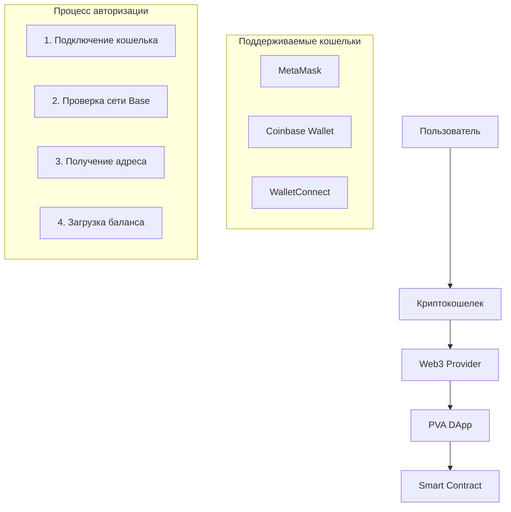

# Система авторизации PVA DApp

## Обзор

PVA DApp использует **Web3-авторизацию** через криптокошельки без традиционных логинов и паролей. Авторизация основана на подключении Ethereum-совместимых кошельков и подписи транзакций.

## Архитектура авторизации

### 1. **Децентрализованная авторизация**


### 2. **Принципы безопасности**
- ✅ **Никаких паролей** - только криптографические подписи
- ✅ **Локальная авторизация** - приватные ключи остаются в кошельке
- ✅ **Сессионное состояние** - подключение сохраняется до закрытия браузера
- ✅ **Автоматическое переподключение** - восстановление сессии при перезагрузке

## Реализация авторизации

### **useWeb3 Hook** (`src/App.jsx`)

Центральный хук для управления Web3 подключением:

```javascript
function useWeb3(toast) {
  const [provider, setProvider] = useState(null);      // Ethers.js provider
  const [signer, setSigner] = useState(null);          // Подписант транзакций
  const [address, setAddress] = useState(null);        // Адрес пользователя
  const [chainId, setChainId] = useState(null);        // ID сети
  const [connected, setConnected] = useState(false);   // Статус подключения
  const [usdtBalance, setUsdtBalance] = useState("0"); // Баланс USDT
  
  // Методы: connect, disconnect, buyOnChain, sellOnChain
}
```

### **Процесс подключения кошелька**

#### 1. **Обнаружение провайдеров**
```javascript
function detectProviders() {
  if (typeof window === "undefined") return [];
  const eth = window.ethereum;
  if (!eth) return [];
  
  // Поддержка множественных провайдеров
  if (eth.providers && Array.isArray(eth.providers)) return eth.providers;
  return [eth];
}
```

#### 2. **Выбор кошелька**
```javascript
const connect = async (type = "metamask") => {
  const providers = detectProviders();
  
  let raw = null;
  if (type === "metamask") {
    raw = providers.find((p) => p.isMetaMask) || providers[0];
  } else if (type === "coinbase") {
    raw = providers.find((p) => p.isCoinbaseWallet) || providers[0];
  }
  
  // Продолжение подключения...
}
```

#### 3. **Проверка и переключение сети**
```javascript
async function ensureBaseNetwork(raw) {
  const chainId = await raw.request({ method: "eth_chainId" });
  
  if (chainId === BASE_CHAIN_ID_HEX) return; // Уже в Base
  
  try {
    // Попытка переключения на Base
    await raw.request({
      method: "wallet_switchEthereumChain",
      params: [{ chainId: BASE_CHAIN_ID_HEX }],
    });
  } catch (e) {
    if (e && e.code === 4902) {
      // Сеть не добавлена, добавляем Base
      await raw.request({
        method: "wallet_addEthereumChain",
        params: [{
          chainId: BASE_CHAIN_ID_HEX,
          chainName: "Base",
          nativeCurrency: { name: "Ether", symbol: "ETH", decimals: 18 },
          rpcUrls: ["https://mainnet.base.org"],
          blockExplorerUrls: ["https://basescan.org"],
        }],
      });
    }
  }
}
```

#### 4. **Установка подключения**
```javascript
// Создание провайдера и получение подписанта
const prov = new ethers.BrowserProvider(raw);
await prov.send("eth_requestAccounts", []); // Запрос доступа к аккаунтам
const signer = await prov.getSigner();
const network = await prov.getNetwork();
const address = await signer.getAddress();

// Сохранение состояния
setProvider(prov);
setSigner(signer);
setAddress(address);
setChainId(network.chainId?.toString());
setConnected(true);
```

#### 5. **Подписка на события кошелька**
```javascript
// Отслеживание смены аккаунта
raw.on("accountsChanged", async (accounts) => {
  const newAddress = accounts && accounts[0];
  if (!newAddress) {
    // Пользователь отключил кошелек
    setAddress(null);
    setConnected(false);
    setUsdtBalance("0");
  } else {
    // Пользователь сменил аккаунт
    setAddress(newAddress);
    setConnected(true);
    await refreshUsdtBalance(prov, newAddress);
  }
});

// Отслеживание смены сети
raw.on("chainChanged", async () => {
  await ensureBaseNetwork(raw);
  const newNetwork = await prov.getNetwork();
  setChainId(newNetwork.chainId?.toString());
  if (address) await refreshUsdtBalance(prov, address);
});
```

## Пользовательский интерфейс авторизации

### **WalletModal Component**

Модальное окно для подключения кошелька:

```jsx
function WalletModal({ open, onClose, web3 }) {
  const { connected, address, usdtBalance, connect, disconnect } = web3;
  
  return (
    <div className="modal">
      {!connected ? (
        // Кнопки подключения
        <div className="grid grid-cols-2 gap-3">
          <button onClick={() => connect("metamask")}>
            MetaMask
          </button>
          <button onClick={() => connect("coinbase")}>
            Coinbase Wallet
          </button>
        </div>
      ) : (
        // Информация о подключенном кошельке
        <div className="wallet-info">
          <div>Адрес: {address}</div>
          <div>Сеть: Base</div>
          <div>Баланс: {usdtBalance} USDT</div>
          <button onClick={disconnect}>Отключить</button>
        </div>
      )}
    </div>
  );
}
```

## Интеграция с системой данных

### **Адрес как идентификатор пользователя**

```javascript
// Все пользовательские данные привязаны к адресу кошелька
const userAddress = "0x1234...5678";

// Настройки пользователя
await UserSettingsService.getUserSettings(userAddress);

// Кэш позиций
await EnhancedLocalStorageCache.load(userAddress);

// Шифрование данных
await SecureStorage.setSecure(key, data, userAddress);
```

### **Автоматическая инициализация данных**

```javascript
// При подключении кошелька автоматически загружаются:
useEffect(() => {
  if (userAddress) {
    // 1. Пользовательские настройки
    loadUserSettings(userAddress);
    
    // 2. Кэшированные позиции
    loadCachedPositions(userAddress);
    
    // 3. Синхронизация с блокчейном
    syncWithBlockchain(userAddress);
  }
}, [userAddress]);
```

## Состояния авторизации

### **1. Не подключен**
- `connected: false`
- `address: null`
- Показывается кнопка "Подключить кошелек"
- Доступен только просмотр публичной информации

### **2. Подключение в процессе**
- `loading: true`
- Показывается индикатор загрузки
- Пользователь подтверждает подключение в кошельке

### **3. Подключен**
- `connected: true`
- `address: "0x..."`
- Полный доступ к функциональности
- Автоматическая загрузка пользовательских данных

### **4. Ошибка подключения**
- `error: "Описание ошибки"`
- Показывается сообщение об ошибке
- Возможность повторной попытки подключения

## Безопасность и лучшие практики

### **Что НЕ хранится в приложении:**
- ❌ Приватные ключи
- ❌ Seed фразы
- ❌ Пароли от кошельков
- ❌ Подписи транзакций

### **Что хранится локально:**
- ✅ Адрес кошелька (публичный)
- ✅ Настройки пользователя (зашифровано)
- ✅ Кэш данных позиций (зашифровано)
- ✅ Состояние подключения (сессия)

### **Проверки безопасности:**
```javascript
// Валидация адреса владельца позиции
const validateOwnership = (position, userAddress) => {
  return position.owner.toLowerCase() === userAddress.toLowerCase();
};

// Проверка сети перед транзакциями
const ensureCorrectNetwork = async () => {
  const chainId = await provider.getNetwork();
  if (chainId.chainId !== BASE_CHAIN_ID) {
    throw new Error("Неправильная сеть");
  }
};
```

## Обработка ошибок авторизации

### **Типичные ошибки:**

1. **Кошелек не установлен**
   ```javascript
   if (!window.ethereum) {
     toast("error", "Установите MetaMask или Coinbase Wallet");
   }
   ```

2. **Пользователь отклонил подключение**
   ```javascript
   catch (error) {
     if (error.code === 4001) {
       toast("error", "Подключение отклонено пользователем");
     }
   }
   ```

3. **Неправильная сеть**
   ```javascript
   if (chainId !== BASE_CHAIN_ID_HEX) {
     await ensureBaseNetwork(provider);
   }
   ```

4. **Недостаточно газа**
   ```javascript
   catch (error) {
     if (error.code === 'INSUFFICIENT_FUNDS') {
       toast("error", "Недостаточно ETH для газа");
     }
   }
   ```

## Автоматическое переподключение

### **Восстановление сессии:**
```javascript
useEffect(() => {
  // Проверяем, был ли кошелек подключен ранее
  const wasConnected = localStorage.getItem('wallet_connected');
  
  if (wasConnected && window.ethereum) {
    // Автоматически переподключаемся
    connect().catch(console.error);
  }
}, []);

// Сохраняем состояние подключения
useEffect(() => {
  if (connected) {
    localStorage.setItem('wallet_connected', 'true');
  } else {
    localStorage.removeItem('wallet_connected');
  }
}, [connected]);
```

## Заключение

Система авторизации PVA DApp обеспечивает:

- ✅ **Безопасность** - никаких паролей, только криптографические подписи
- ✅ **Удобство** - автоматическое переподключение и восстановление сессии
- ✅ **Совместимость** - поддержка популярных кошельков
- ✅ **Надежность** - обработка всех типов ошибок
- ✅ **Интеграция** - тесная связь с системой управления данными

Авторизация происходит **полностью на стороне клиента** без серверов авторизации, что обеспечивает максимальную децентрализацию и безопасность.